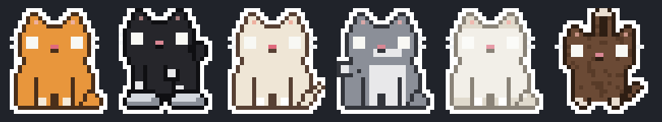

# SondeR cat 🐾

A pixel cat that lives on your desktop — for **Windows** and **Linux**.
Free, open source, no telemetry, no accounts.



> Inspired by the lovely [Comnyang](https://comnyang.com/en) (macOS).
> SondeR cat is an unofficial, from-scratch implementation with its own code
> and art, for people not on a Mac. If you use macOS, go support the
> original!

## Features

**Reacts to you**
- 👀 **Eye follow** — pupils track your cursor anywhere on screen
- 🔴 **Laser hunt** — wiggle the cursor side-to-side like a laser dot and the cat gallops after it (sensitivity: high / medium / low)
- 🐾 **Purring pets** — rub its head with the mouse → hearts + "purrr…"
- 🍡 **Mochi drag** — grab it and it hangs from your cursor by its paws, stretching like mochi as you swing it; shake for wobble
- 😾 **Startle** — buzz the cursor past it and it jumps
- ⌨️ **Keyboard kneading** — types along with you on tiny 3D keycaps, stops the moment you do
- 🔥 **Overheat mode** — type too fast and the whole cat turns red with steam puffing over its head
- 📜 **Paper unroll** — scroll and it unspools a paper roll with a torn edge

**Being a good coworker**
- 😴 Naps when you're idle; wakes with a "mrrp?"
- 📺 **Peek mode** — auto-hides at the bottom edge during fullscreen video; or send it to hide by wiggling your cursor up-down at the bottom of the screen
- 🧘 **Stretch reminders** — it *grows big* and stretches with you every 30/50/90 min
- 🍅 **Pomodoro** — focus/break **loops** with a pixel timer floating next to the cat
- ⏰ **Message reminders** — "Ali, 21:30 'Meeting'" in a red bubble, with a meow
- 📌 **Pinned note** — keep an important message above its head
- 🗣️ **Tell it your name** — it calls you by name in reminders and breaks

**AI agent reactions** (Claude Code, Codex CLI, or any command)
- 🤔 **Thinking along** — thought bubbles + upward gaze while your agent works
- 🎉 **Agent done jump** — happy hop + meow when the task finishes
- Hook up via `sonder_agent.py` (wrap any command) or Claude Code hooks — see below

**Make it yours**
- 🎨 10 fur colors + any custom color, 5 patterns (tabby / solid / tuxedo / spots / siamese)
- 🐈🐈 **Multiple cats**, each with its own look
- 📏 7 sizes from tiny 2× to chunky 10×; positions and settings remembered

## Install

### Windows — one file, everything inside

**[Download SondeR_cat_setup.exe](https://github.com/Verisonder/SondeR-Cat/raw/main/SondeR_cat_setup.exe)** (20 MB) and double-click it.

A graphical installer (no terminal, ever) does the rest:
- unpacks the cat with **all components pre-extracted inside the exe** —
  no pip, no downloads, nothing to install for this step
- if your PC has no Python at all, it fetches that one piece automatically
  (via Windows' package manager)
- creates a Desktop shortcut with the cat icon, offers start-with-Windows,
  and launches your cat

SmartScreen may warn about a new unsigned app — click *More info → Run
anyway*. The installer's full source code is right here in this repo
(`setup_stub.c`), built by `build_exe.py`.

**From source instead:** download the repo zip, extract it, and double-click
**`CLICK_ME_TO_INSTALL.bat`** — it finds and runs the classic installer from
wherever you extracted.

### Linux

```bash
git clone https://github.com/Verisonder/SondeR-Cat.git
cd SondeR-Cat && ./install.sh
```

`install.sh` detects your package manager (apt / dnf / pacman / zypper /
apk), checks system libraries, and offers to fix anything missing.

Requires Python 3.9+ · Dependencies: PySide6 (Essentials), pynput

## Hooking up AI agents

The cat watches `~/.sondercat_agent`. Write `working|Label` while an agent
runs and `done|Label` when it finishes.

Wrap any command:
```bash
python sonder_agent.py run "Codex" -- codex "fix the failing tests"
```

Claude Code hooks (`~/.claude/settings.json`):
```json
{
  "hooks": {
    "UserPromptSubmit": [
      { "hooks": [ { "type": "command",
        "command": "python /path/to/sonder_agent.py working \"Claude Code\"" } ] }
    ],
    "Stop": [
      { "hooks": [ { "type": "command",
        "command": "python /path/to/sonder_agent.py done \"Claude Code\"" } ] }
    ]
  }
}
```

Try it instantly: right-click the cat → *AI agent reactions → Test*.

## Linux support

| Environment | Status |
|---|---|
| **X11 / Xorg** (any distro) | ✅ Everything works |
| **Wayland with XWayland** (default on Ubuntu, Fedora, etc.) | ✅ Auto-detected — the cat routes itself through XWayland for full features |
| **Pure Wayland** (no XWayland) | ⚠️ Runs, but global cursor tracking / hooks / self-positioning are restricted by Wayland's security model — the cat tells you at startup |
| **GNOME** | ✅ Note: GNOME hides system trays — just right-click the *cat* for the full menu |

Tested package managers: **apt** (Debian/Ubuntu/Mint), **dnf** (Fedora),
**pacman** (Arch), **zypper** (openSUSE), **apk** (Alpine). `install.sh`
detects yours, checks for the Qt system libraries (`xcb-cursor`,
`xkbcommon-x11`, GL), and offers to install anything missing with the right
command for your distro. If the window ever fails to open:

```bash
# Debian/Ubuntu        sudo apt install libxcb-cursor0 libgl1 libxkbcommon-x11-0 libegl1
# Fedora               sudo dnf install xcb-util-cursor libxkbcommon-x11
# Arch                 sudo pacman -S xcb-util-cursor libxkbcommon-x11
# openSUSE             sudo zypper install libxcb-cursor0 libxkbcommon-x11-0
# Alpine               sudo apk add xcb-util-cursor mesa-gl libxkbcommon
```

## Troubleshooting

- **The graphical installer failed** → it saves logs you can send to the
  developer: `%TEMP%\SondeRcat_setup.log` (steps) and
  `%TEMP%\SondeRcat_pip.log` (component details). Paste `%TEMP%` into the
  Explorer address bar to get there.
- **Shortcut does nothing** → run `debug.bat` from the install folder
  (`%LOCALAPPDATA%\SondeRcat\sondercat`) to see the error; crashes are also
  logged to `sondercat_error.log` in your home folder.
- **No reaction to scrolling** → right-click the cat → *Behavior → Scroll
  doctor* runs a 5-second live test and tells you whether global mouse hooks
  are being blocked (usually antivirus). Scrolling while hovering the cat
  always works.
- **Linux** — see the support matrix above; `install.sh` diagnoses most
  issues, and the app prints exact package commands if display libraries
  are missing.

## Customizing the art

Every animation frame is a plain-text pixel grid in `sprites.py` — one
character per pixel. Edit frames, add palettes to `PALETTES`, or new pattern
rules to `apply_pattern()`; the menus update automatically.

## License

[MIT](LICENSE) — do whatever you like, no warranty.
